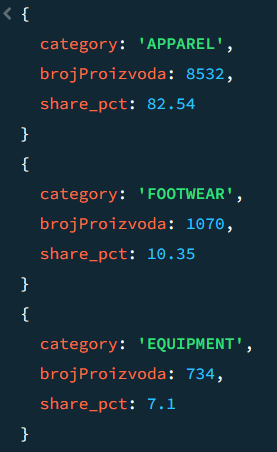
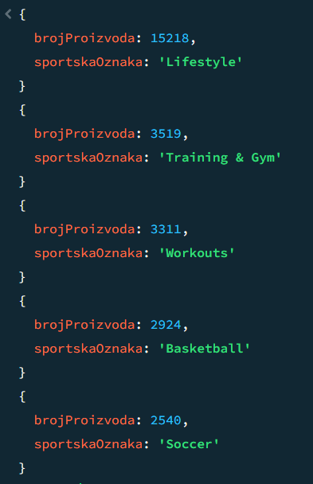
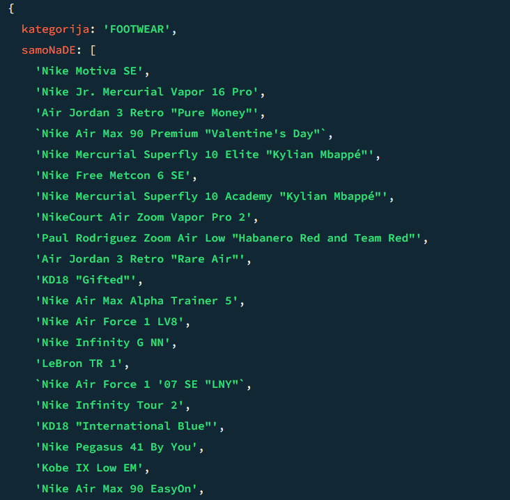
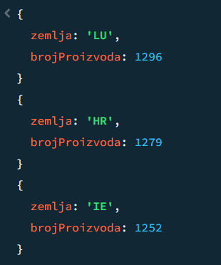
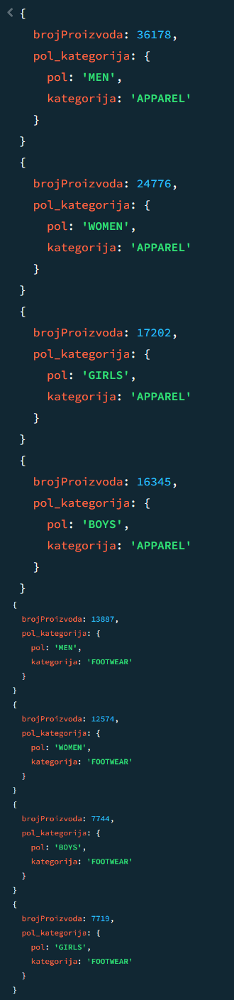

# Upiti

## 1. Pronaći top 3 kategorije po broju proizvoda na US tržištu, kao i njihov udeo (%) u ukupnom broju proizvoda na tom tržištu.



```javascript
db.proizvod.aggregate([
  {
    $match: { market_id: "US" }
  },
  {
    $group: {
      _id: "$category",
      brojProizvoda: { $sum: 1 }
    }
  },
  {
    $group: {
      _id: null,
      categories: {
        $push: { category: "$_id", brojProizvoda: "$brojProizvoda"}
      },
      ukupnoProizvoda: { $sum: "$brojProizvoda" }
    }
  },
  {
    $unwind: "$categories" 
  },
  {
    $project: {
      _id: 0,
      category: "$categories.category",
      brojProizvoda: "$categories.brojProizvoda",
      share_pct: {
        $round: [
          {
            $multiply: [
              { $divide: ["$categories.brojProizvoda", "$ukupnoProizvoda"] },
              100
            ]
          },
          2
        ]
      }
    }
  },
  { $sort: { brojProizvoda: -1 } },
  { $limit: 3 }
])
```

## 2. Koji sportovi imaju najveći broj jedinstvenih dostupnih proizvoda na tržištu (globalno), i prikazati top 5 sportova po tom broju.



```javascript
db.proizvod.aggregate([
  {
    $match: {
      "availability.available_market": true
    }
  },
  {
    $unwind: "$sport_tags"
  },
  {
    $group: {
      _id: { sport_tag: "$sport_tags", product: "$product_id" },
    }
  },
  {
    $group: {
      _id: "$_id.sport_tag",
      brojProizvoda: { $sum: 1 }
    }
  },
  {
    $sort: { brojProizvoda: -1 }
  },
  {
    $limit: 5
  }
])
```

## 3. Za nemačko i francusko tržište, u kategorijama FOOTWEAR, APPAREL i EQUIPMENT, pronaći koje kategorije imaju proizvode dostupne samo na DE tržištu, a ne i na FR.



```javascript
db.proizvod.aggregate([
  {
    $match: {
      market_id: { $in: ["DE", "FR"] },
      category: { $in: ["FOOTWEAR", "APPAREL", "EQUIPMENT"] },
      "availability.available_market": true
    }
  },
  {
    $group: {
      _id: {
        market: "$market_id",
        category: "$category"
      },
      proizvodiNaTrzistuPoKategoriji: {
        $addToSet: "$product_id"
      }
    }
  },
  {
    $group: {
      _id: "$_id.category",
      proizvodiNaTrzistu: {
        $push: {
          market: "$_id.market",
          proizvodi: "$proizvodiNaTrzistuPoKategoriji"
        }
      }
    }
  },
  {
    $project: {
      _id: 0,
      kategorija: "$_id",

      de: {
        $first: {
          $filter: {
            input: "$proizvodiNaTrzistu",
            cond: { $eq: ["$$this.market", "DE"] }
          }
        }
      },

      fr: {
        $first: {
          $filter: {
            input: "$proizvodiNaTrzistu",
            cond: { $eq: ["$$this.market", "FR"] }
          }
        }
      }
    }
  },
  {
    $project: {
      kategorija: 1,
      samoNaDE: {
        $setDifference: ["$de.proizvodi", "$fr.proizvodi"]
      }
    }
  }
])
```

## 4. Na evropskim tržištima (valuta EUR) pronaći top 3 zemlje sa najvećim brojem različitih varijanti obuće (style_color) među dostupnim proizvodima u kategoriji FOOTWEAR.



```javascript
db.proizvod.aggregate([
  {
    $lookup: {
      from: "trziste",
      localField: "market_id",
      foreignField: "_id",
      as: "trziste_info"
    }
  },
  {
    $match: {
      "trziste_info.currency": "EUR",
      "category": "FOOTWEAR",
      "availability.available_market": true
    }
  },
  {
    $group: {
      "_id": "$market_id",
      proizvodi: { $addToSet: "$style_color" }
    }
  },
  {
		$project: {
      _id: 0,
      zemlja: "$_id",
      brojProizvoda: { $size: "$proizvodi" }
    }
  },
  {
    $sort: {
      brojProizvoda: -1
    }
  },
  {
    $limit: 3
  }
])
```

## 5. Za svaki pol kom je namenjen proizvod (gender_segment), na evropskim tržištima (region: Europe), pronaći koja je najzastupljenija kategorija proizvoda (category) po broju proizvoda.



```javascript
db.proizvod.aggregate([
  {
    $lookup: {
      from: "trziste",
      localField: "market_id",
      foreignField: "_id",
      as: "trziste_info"
    }
  },
  {
    $match: {
      "trziste_info.region": "Europe",
      "availability.available_market": true
    }
  },
  {
    $unwind: "$gender_segment"
  },
  {
    $group: {
      _id: { pol: "$gender_segment", kategorija: "$category" },
      brojProizvoda: { $sum: 1 }
    }
  },
  {
    $project: {
      _id: 0,
      pol_kategorija: "$_id",
      brojProizvoda: 1
    }
  },
  {
    $sort: {
      brojProizvoda: -1
    }
  }
])
```