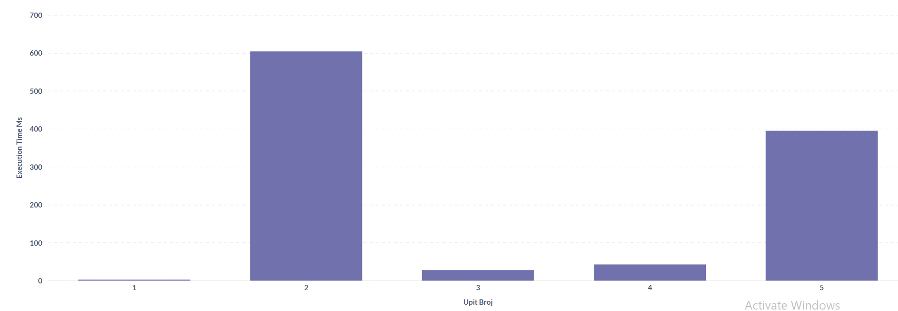

# Optimizacije

## Kreirani indeksi


```javascript
db.proizvod.createIndex({
  market_id: 1,
  category: 1,
  "availability.available_market": 1
})

db.proizvod.createIndex({
  currency: 1,
  category: 1,
  "availability.available_market": 1
})
```


## Šablon proširene reference - da bi se izbegao lookup nad ```trziste```, kolekcija ```proizvod``` se proširuje sa neophodnim poljima.

```javascript
db.proizvod.aggregate([
  {
    $lookup: {
      from: "trziste",
      localField: "market_id",
      foreignField: "_id",
      as: "trziste_info"
    }
  },
  {
    $addFields: {
      currency: { $arrayElemAt: ["$trziste_info.currency", 0] },
      region: { $arrayElemAt: ["$trziste_info.region", 0] }
    }
  },
  { $project: { trziste_info: 0 } },
  {
    $merge: {
      into: "proizvod",
      on: "_id",
      whenMatched: "merge",
      whenNotMatched: "discard"
    }
  }
], { allowDiskUse: true })
```

## Šablon proračunavanja - računa statistiku za 1. upit te se kasnije u samom upitu samo čita iz nove kolekcije.

```javascript
db.proizvod.aggregate([
  {
    $group: {
      _id: { market_id: "$market_id", category: "$category" },
      brojProizvoda: { $sum: 1 }
    }
  },
  {
    $group: {
      _id: "$_id.market_id",
      ukupnoProizvoda: { $sum: "$brojProizvoda" },
      kategorije: {
        $push: {
          category: "$_id.category",
          brojProizvoda: "$brojProizvoda"
        }
      }
    }
  },
  { $unwind: "$kategorije" },
  {
    $project: {
      _id: {
        $concat: ["$_id", ":", "$kategorije.category"]
      },
      market_id: "$_id",
      category: "$kategorije.category",
      brojProizvoda: "$kategorije.brojProizvoda",
      share_pct: {
        $round: [
          {
            $multiply: [
              { $divide: ["$kategorije.brojProizvoda", "$ukupnoProizvoda"] },
              100
            ]
          },
          2
        ]
      }
    }
  },
  { $out: "statistika_kategorija" }
], { allowDiskUse: true })
```

# Upiti

## 1. Pronaći top 3 kategorije po broju proizvoda na US tržištu, kao i njihov udeo (%) u ukupnom broju proizvoda na tom tržištu.

```javascript
db.statistika_kategorija.aggregate([
  { $match: { market_id: "US" } },
  { $sort: { brojProizvoda: -1 } },
  { $limit: 3 },
  {
    $project: {
      _id: 0,
      category: 1,
      brojProizvoda: 1,
      share_pct: 1
    }
  }
])
```

## 2. Koji sportovi imaju najveći broj jedinstvenih dostupnih proizvoda na tržištu (globalno), i prikazati top 5 sportova po tom broju.

```javascript
db.proizvod.aggregate([
  {
    $match: {
      "availability.available_market": true
    }
  },
  {
    $unwind: "$sport_tags"
  },
  {
    $group: {
      _id: { sport_tag: "$sport_tags", product: "$product_id" },
    }
  },
  {
    $group: {
      _id: "$_id.sport_tag",
      brojProizvoda: { $sum: 1 }
    }
  },
  {
    $sort: { brojProizvoda: -1 }
  },
  {
    $limit: 5
  }
])
```

## 3. Za nemačko i francusko tržište, u kategorijama FOOTWEAR, APPAREL i EQUIPMENT, pronaći koje kategorije imaju proizvode dostupne samo na DE tržištu, a ne i na FR.

```javascript
db.proizvod.aggregate([
  {
    $match: {
      market_id: { $in: ["DE", "FR"] },
      category: { $in: ["FOOTWEAR", "APPAREL", "EQUIPMENT"] },
      "availability.available_market": true
    }
  },
  {
    $group: {
      _id: {
        market: "$market_id",
        category: "$category"
      },
      proizvodiNaTrzistuPoKategoriji: {
        $addToSet: "$product_id"
      }
    }
  },
  {
    $group: {
      _id: "$_id.category",
      proizvodiNaTrzistu: {
        $push: {
          market: "$_id.market",
          proizvodi: "$proizvodiNaTrzistuPoKategoriji"
        }
      }
    }
  },
  {
    $project: {
      _id: 0,
      kategorija: "$_id",

      de: {
        $first: {
          $filter: {
            input: "$proizvodiNaTrzistu",
            cond: { $eq: ["$$this.market", "DE"] }
          }
        }
      },

      fr: {
        $first: {
          $filter: {
            input: "$proizvodiNaTrzistu",
            cond: { $eq: ["$$this.market", "FR"] }
          }
        }
      }
    }
  },
  {
    $project: {
      kategorija: 1,
      samoNaDE: {
        $setDifference: ["$de.proizvodi", "$fr.proizvodi"]
      }
    }
  }
])
```

## 4. Na evropskim tržištima (valuta EUR) pronaći top 3 zemlje sa najvećim brojem različitih varijanti obuće (style_color) među dostupnim proizvodima u kategoriji FOOTWEAR.

```javascript
db.proizvod.aggregate([
  {
    $match: {
      currency: "EUR",
      category: "FOOTWEAR",
      "availability.available_market": true
    }
  },
  {
    $group: {
      _id: "$market_id",
      proizvodi: { $addToSet: "$style_color" }
    }
  },
  {
    $project: {
      _id: 0,
      zemlja: "$_id",
      brojVarijanti: { $size: "$proizvodi" }
    }
  },
  { $sort: { brojVarijanti: -1 } },
  { $limit: 3 }
])
```

## 5. Na evropskim tržištima (valuta EUR) pronaći top 3 zemlje sa najvećim brojem različitih dostupnih veličina obuće koje su dostupne u kategoriji FOOTWEAR.

```javascript
db.proizvod.aggregate([
  {
    $match: {
      region: "Europe",
      "availability.available_market": true
    }
  },
  { $unwind: "$gender_segment" },
  {
    $group: {
      _id: { pol: "$gender_segment", kategorija: "$category" },
      brojProizvoda: { $sum: 1 }
    }
  },
  {
    $project: {
      _id: 0,
      pol_kategorija: "$_id",
      brojProizvoda: 1
    }
  },
  { $sort: { brojProizvoda: -1 } }
])
```

# Vreme izvršavanja upita sa optimizacijom

