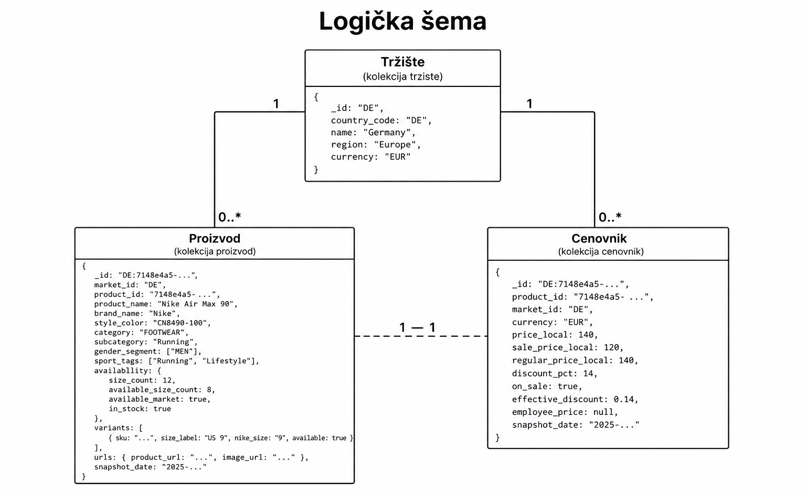

# Nike Global Catalogue - MongoDB (SBP)

Skup podataka: [Nike Global Catalogue 2026](https://www.kaggle.com/datasets/bsthere/nike-global-catalogue-2026/data) - Nike proizvodi sa zvaničnih web prodavnica u 45 zemalja.

Baza: `sbp-nike` · Kolekcije: `proizvod`, `cenovnik`, `trziste`

---

## Logička šema

| Kolekcija | Šta sadrži |
|-----------|------------|
| **trziste** | Podaci o tržištu (država, region, valuta). |
| **proizvod** | Pojava proizvoda u katalogu jedne zemlje - kategorija, sportovi, dostupnost, varijante (veličine). |
| **cenovnik** | Cene i popusti za istu pojavu proizvoda na tržištu (`_id` = `market_id:product_id`, kao kod `proizvod`). |
---

## Boris - menadžer proizvoda

Agregacioni upiti (tekst):

1. Pronaći top 3 kategorije po broju proizvoda na US tržištu, kao i njihov udeo (%) u ukupnom broju proizvoda na tom tržištu.

2. Koji sportovi imaju najveći broj jedinstvenih dostupnih proizvoda na tržištu (globalno), i prikazati top 5 sportova po tom broju.

3. Za nemačko i francusko tržište, u kategorijama FOOTWEAR, APPAREL i EQUIPMENT, pronaći koje kategorije imaju proizvode dostupne samo na DE tržištu, a ne i na FR.

4. Na evropskim tržištima (valuta EUR) pronaći top 3 zemlje sa najvećim brojem različitih varijanti obuće (`style_color`) među dostupnim proizvodima u kategoriji FOOTWEAR.

5. Za svaki pol kom je namenjen proizvod (`gender_segment`), na evropskim tržištima (region: Europe), pronaći koja je najzastupljenija kategorija proizvoda (`category`) po broju proizvoda.
